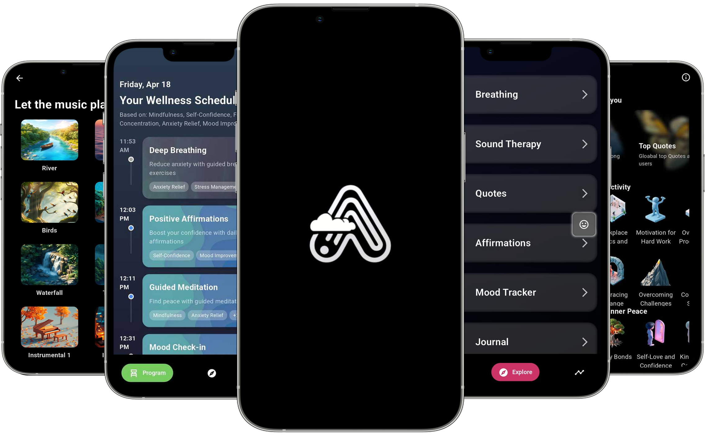
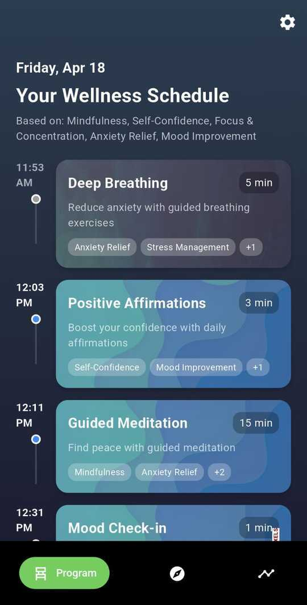
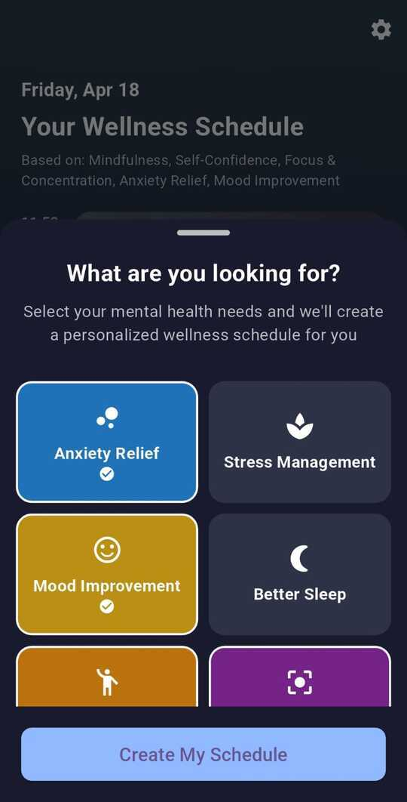
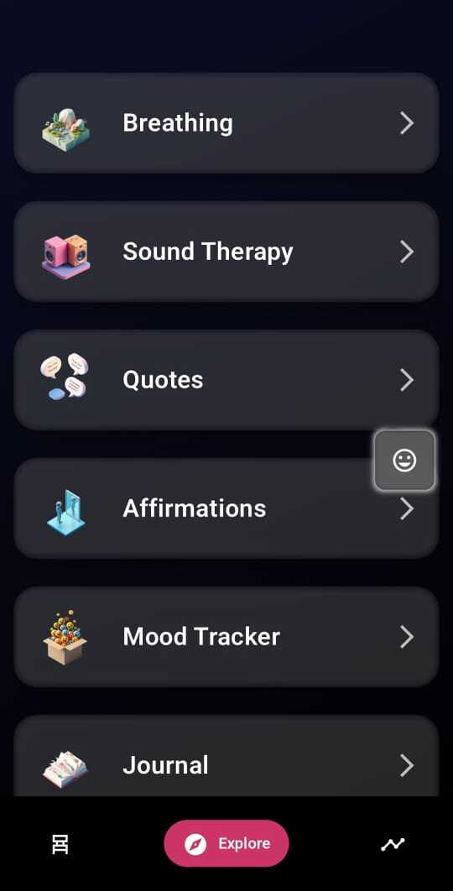
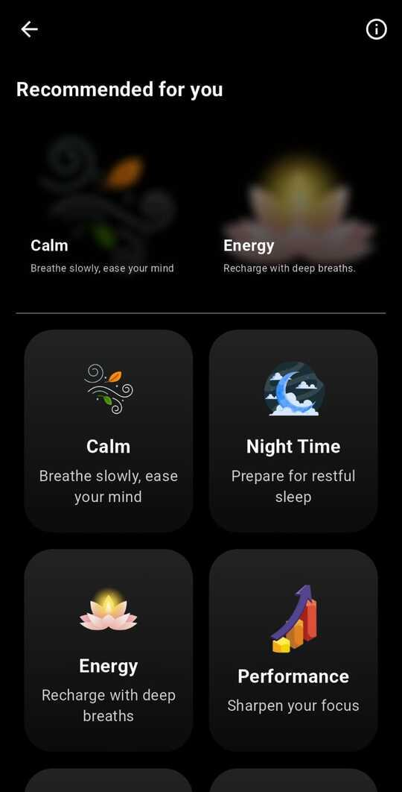
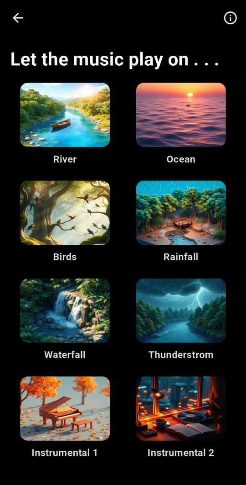
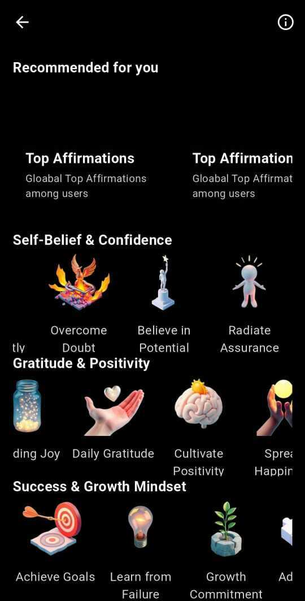
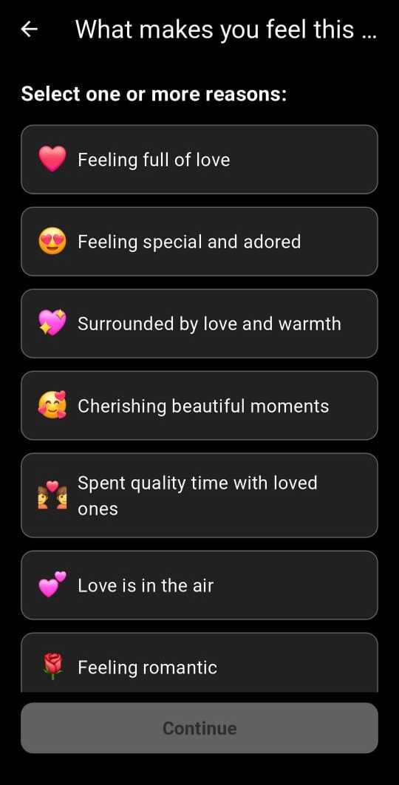
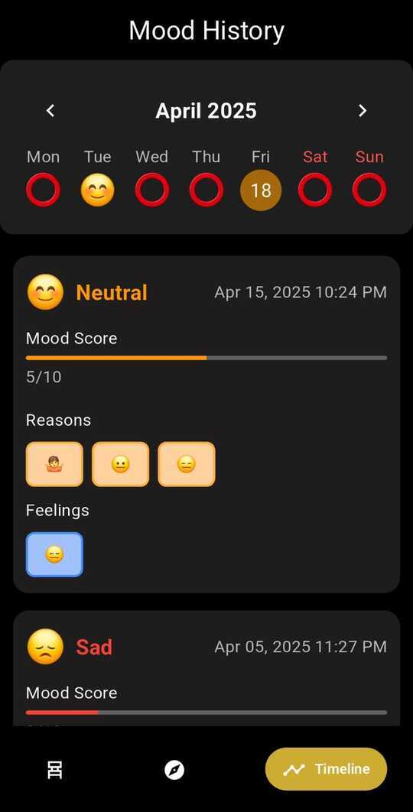

#  AARAV

Welcome to **aarav**, a cutting-edge Flutter application designed to revolutionize your experience. 🚀

---

## ✨ Features

- 🌐 **Modern UI**: Sleek and futuristic design.
- ⚡ **High Performance**: Optimized for speed and efficiency.
- 📱 **Cross-Platform**: Runs seamlessly on iOS, Android, and beyond.
- 🔒 **Secure**: Built with security in mind.

---

## 📸 Screenshots

> _Application Screenshots._




| Home Screen | Personalized Schedule |
|-------------|------------------------|
|  |  |
| Overview landing page of the app. | A custom daily routine planner. |

| Features Screen | Breathing Page |
|-----------------|----------------|
|  |  |
| Showcases core features and functionalities. | Guides users through calming breathing exercises. |

| Sound Therapy Page | Quotes Page |
|--------------------|-------------|
|  |  |
| Relaxing audio sessions for mental wellness. | Collection of motivational and inspiring quotes. |

| Affirmation Page | Mood Tracker |
|------------------|--------------|
|  |  |
| Displays daily positive affirmations. | Enables users to log and track their moods. |

| Mood Tracker Details Page | Timeline Page |
|---------------------------|----------------|
|  |  |
| In-depth view of mood entries and patterns. | Chronological view of user activities and progress. |

---

## 🚀 Getting Started

Follow these steps to get started with **aarav**:

1. Clone the repository:
   ```bash
   git clone https://github.com/your-repo/aarav.git
   ```
2. Navigate to the project directory:
   ```bash
   cd aarav
   ```
3. Install dependencies:
   ```bash
   flutter pub get
   ```
4. Run the app:
   ```bash
   flutter run
   ```

---

## 📚 Documentation

For detailed guidance, refer to the [Flutter documentation](https://docs.flutter.dev/).

---

## 🤝 Contributing

We welcome contributions! Feel free to submit issues or pull requests.

---

## 📄 License

This project is licensed under the [MIT License](LICENSE).

---

## 🌌 Future Enhancements

- AI-powered features.
- Advanced analytics dashboard.
- Multi-language support.

---
